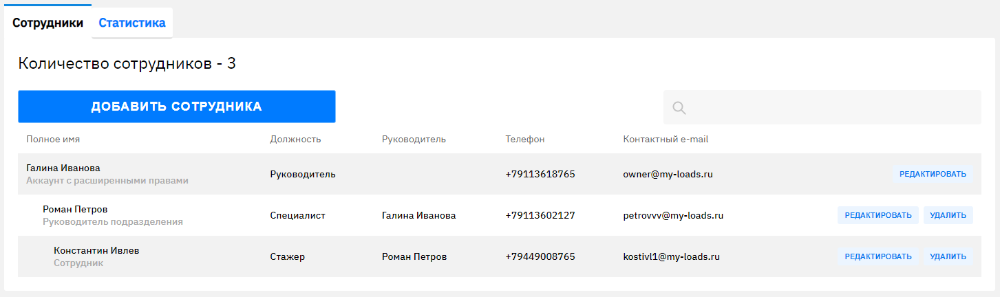
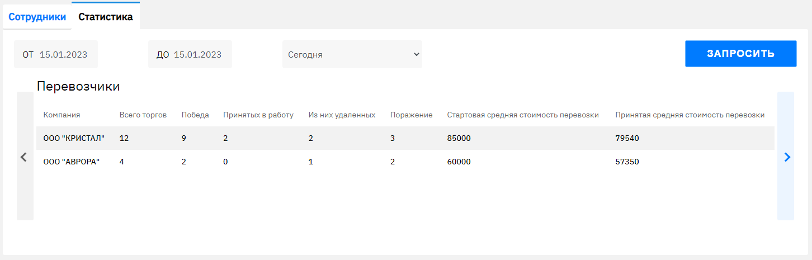
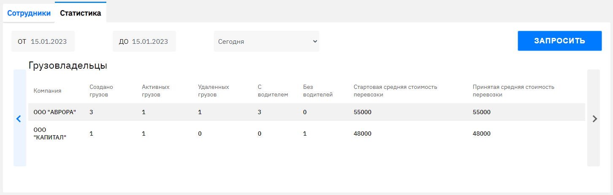
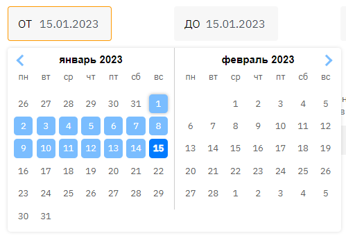

# Задание для компании "Мои загрузки"
## Аналитика перевозок
### Разработать функционал в профиле компании, который будет показывать статистику перевозок.

#### Обязательные поля у грузовладельца:
1. Создано грузов
2. Активные грузы
3. Удаленные
4. Грузы с назначенным перевозчиком
5. Грузы без перевозчика
6. Средняя стартовая цена
7. Средняя итоговая цена перевозки

#### Обязательные поля у перевозчика:
1. Активные грузы
2. Кол-во торгов за грузы
3. Отказ от перевозки/удаленные
4. Победы
5. Проигрыши
6. Средняя стартовая цена
7. Средняя итоговая цена перевозки

#### Общие поля фильтра:
1. Выбор периода (календарь)
2. Выбор периода (залоченные значения)

### На платформе предусмотрены права доступа у сотрудников: Главный аккаунт (полный доступ), Расширенные (полный доступ), Руководитель подразделения (работает только в рамках прикрепленных сотрудников у нему), Обычные (доступ только в рамках своей учетной записи). У всех, кроме обычных сотрудников добавить фильтр по сотрудникам:
1. Все сотрудники
2. возможность выбора нескольких сотрудников или одного

## Для запуска проекта

### Клонируем репозиторий:
```
npm install
```
### и запускаем проект:
```
npm start
```
## В проекте использовались:

### Frontend:
- JavaScript
- React
- верстка согласно макету

[< Ссылка на репозиторий >](https://github.com/ferimasv/myloads_frontend)

#### Сотрудники
При открытии страницы происходит запрос на данные сотрудников компаний



#### Статистика
После нажатия на "Запрос" получаем данные по компаниям





Фильтр



### Backend:
- Golang
- PostgreSQL

[< Ссылка на репозиторий >](https://github.com/Ikiso/myloadsServer)
